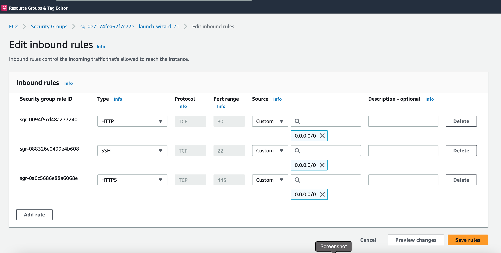
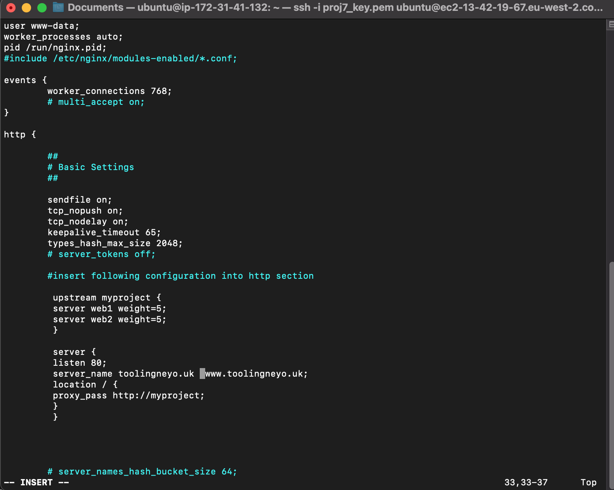
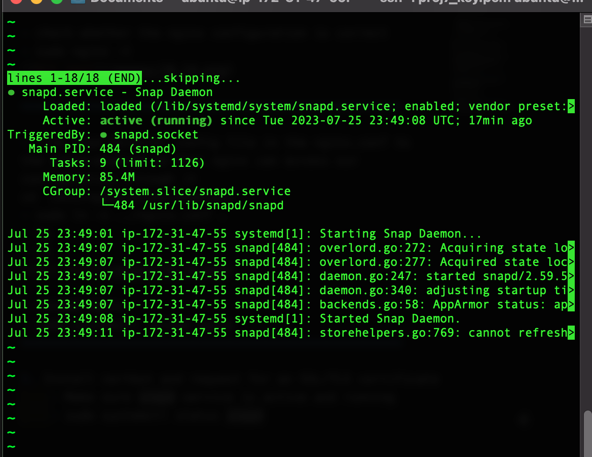
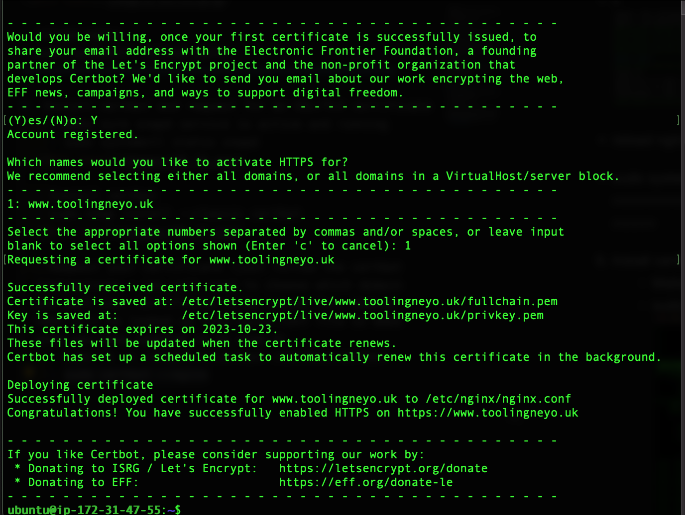
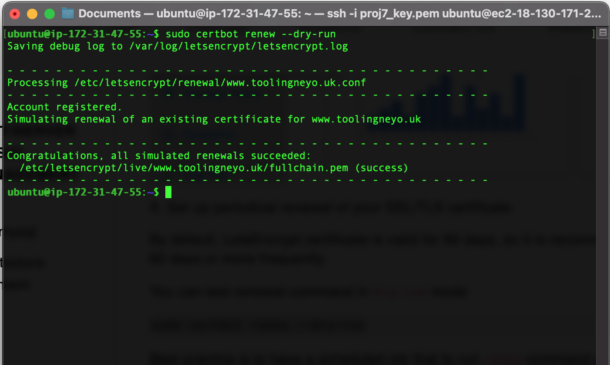
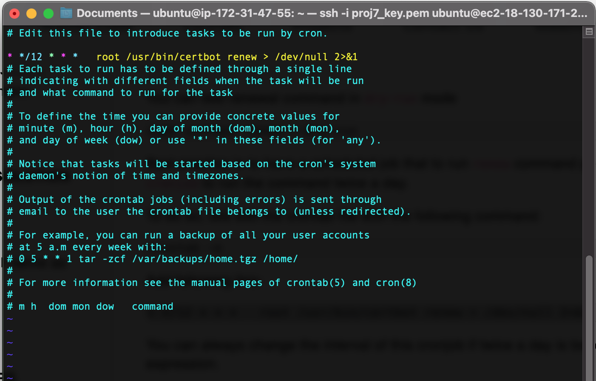

# LOAD BALANCER SOLUTION WITH NGINX AND SSL/TLS
Apache and Nginx are two major players in the web server business spanning 5 percent of web traffic over the internet, but they are different from each other.

> The main difference between Apache and Nginx lies in their design architecture. Apache uses a process-driven approach and creates a new thread for each request while Nginx uses an event-driven architecture to handle multiple requests within one thread.

Some of the differences between Apache and Nginx include:

|      Apache                                                   |       Nginx                                                   |
| ---------------------------------------------------------     |---------------------------------------------------------------|
| Apache runs on all Unix like systems such as Linux, BSD, etc. as well as completely supports windows | Nginx runs on modern Unix like systems; however it has limited support for Windows.|
| Apache uses a multi-threaded approach to process client requests.|Nginx follows an event-driven approach to serve client requests.|
| Apache cannot handle multiple requests concurrently with heavy web traffic.| Nginx can handle multiple client requests concurrently and efficiently with limited hardware resources.|
| Apache processes dynamic content within the web server itself | Nginx can't process dynamic content natively.|
| Apache is designed to be a web server. | Nginx is both a web server and a [proxy server](https://www.fortinet.com/resources/cyberglossary/proxy-server).|
| The performance of Apache for static content is lower than Nginx.| Nginx can simultaneously run thousands of connections of static content two times faster than Apache and uses little less memory.|

As a **DevOps engineer** we should be versatile with alternative solutions for our web servers.

> In this project, we will replace the Apache load balancer in [project-9](https://github.com/Olaminiyi/Project-9), configure an Nginx Load Balancer solution and also ensure that connections to our Web solutions are secure and information is encrypted in transit – we will make sure that the connection over HTTP is secure (HTTPS protocol).

The data moving between a client (browser) and a Web Server over the Internet passes through multiple network devices. If the data is not encrypted, it can be relatively easy to intercept by someone who has access to the intermediate equipment. This kind of information security threat is called [Man-In-The-Middle (MIMT)attack](https://en.wikipedia.org/wiki/Man-in-the-middle_attack).

[SSL](https://en.wikipedia.org/wiki/Transport_Layer_Security#SSL_1.0,_2.0,_and_3.0) and its newer version, TSL – is a security technology that protects connection from [MITM](https://en.wikipedia.org/wiki/Man-in-the-middle_attack) attacks by creating an encrypted session between browser and Web server. Here we will refer this family of cryptographic protocols as [SSL/TLS](https://en.wikipedia.org/wiki/Transport_Layer_Security#SSL_1.0,_2.0,_and_3.0). SSL/TLS uses [digital certificates](https://en.wikipedia.org/wiki/Public_key_certificate) to identify and validate a Website. A browser reads the certificate issued by a Certificate Authority (CA) to make sure that the website is registered in the CA so it can be trusted to establish a secured connection.

> We will register our website with [LetsEnrcypt](https://letsencrypt.org/) Certificate Authority, to automate certificate issuance you will use a shell client recommended by LetsEncrypt – [certbot](https://certbot.eff.org/).

**This project consists of two parts:**
- Configure Nginx as a Load Balancer.
- Register a new domain name and configure secured connection using SSL/TLS certificates.
The target architecture looks like this:


### Configure Nginx as a Load Balancer.

Create an EC2 VM based on Ubuntu Server 20.04 LTS and name it Nginx LB


open TCP port 80 for HTTP connections, also open TCP port 443 – this port is used for secured HTTPS connections



Update /etc/hosts file for local DNS with Web Servers’ names (e.g. Web1 and Web2) and their local IP addresses


Install and configure Nginx as a load balancer to point traffic to the resolvable DNS names of the webservers
Update the instance and Install Nginx
```
sudo apt update
sudo apt install nginx
```  


### Configuration for reverse proxy setting
Configure Nginx LB using Web Servers’ names defined in /etc/hosts
 ```   
sudo vi /etc/nginx/nginx.conf
```
Restart Nginx and make sure the service is up and running
```    
sudo systemctl restart nginx
sudo systemctl status nginx
```


### Register a new domain name with any registrar of your choice in any domain zone (e.g. .com, .net, .org, .edu, .info, .xyz or any other)


create a hosted name in the Route 53 with the registered domain name 
**This will generate name servers i.e 4 in numbers**


**Assign an Elastic IP to your Nginx LB server and associate your domain name with this Elastic IP (I'm using public ip adresses instead of elastic ip)**

**Create 2 records**
copy the public ip address of the load balancer 
    - point the new record to the ip address of the load balancer

    - leave the record name of the first one empty
    

    - create another record referencing www


- **Update A record in your registrar to point to Nginx LB using Elastic IP address**
    - update the nameservers in the domain provider website with the 4 generated name servers generated when the hosted name was created
    


 # update the nginx config file with the domain name


- remove the default site so that the reverse proxy will be redirecting to the newly configuration file
- sudo rm -f /etc/nginx/sites-enabled/default


- check whether the nginx configuration is correct
- sudo nginx -t


5. Install certbot and request for an SSL/TLS certificate
    - Make sure snapd service is active and running
    - sudo systemctl status snapd
    

  - Install certbot
  - sudo snap install --classic certbot
  

  - Request your certificate (just follow the certbot instructions – you will need to choose which domain you want your certificate to be issued for, domain name will be looked up from nginx.conf file so make sure you have updated it on step 4)
    - sudo ln -s /snap/bin/certbot /usr/bin/certbot
    - sudo certbot --nginx
    
    

6. Set up periodical renewal of your SSL/TLS certificate
By default, LetsEncrypt certificate is valid for 90 days, so it is recommended to renew it at least every 60 days or more frequently.
- You can test renewal command in dry-run mode
 - sudo certbot renew --dry-run
 

 - Best practice is to have a scheduled job that to run renew command periodically. Let us configure a cronjob to run the command twice a day.

To do so, lets edit the crontab file with the following command:
    - crontab -e

