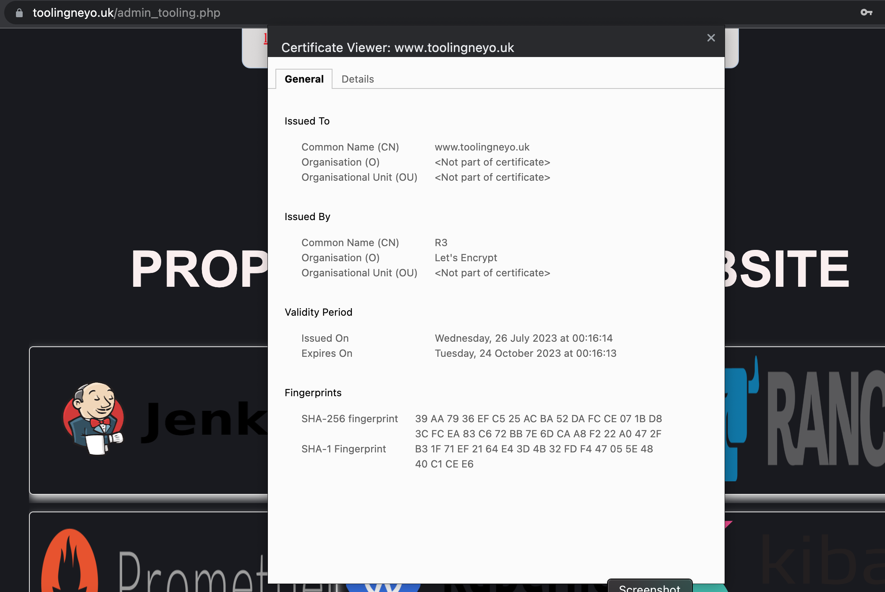

1. Create an EC2 VM based on Ubuntu Server 20.04 LTS and name it Nginx LB

2. open TCP port 80 for HTTP connections, also open TCP port 443 – this port is used for secured HTTPS connections

3. Update /etc/hosts file for local DNS with Web Servers’ names (e.g. Web1 and Web2) and their local IP addresses

4. Install and configure Nginx as a load balancer to point traffic to the resolvable DNS names of the webservers
    - Update the instance and Install Nginx
    sudo apt update
    sudo apt install nginx
    

- Configuration for reverse proxy setting
    - Configure Nginx LB using Web Servers’ names defined in /etc/hosts
    - sudo vi /etc/nginx/nginx.conf

-  Restart Nginx and make sure the service is up and running
    - sudo systemctl restart nginx
    - sudo systemctl status nginx
    

- Register a new domain name with any registrar of your choice in any domain zone (e.g. .com, .net, .org, .edu, .info, .xyz or any other)
 

- create a hosted name in the Route 53 with the registered domain name 
    - this will generate name servers i.e 4 in numbers
    

- **Assign an Elastic IP to your Nginx LB server and associate your domain name with this Elastic IP (I'm using public ip adresses instead of elastic ip)**

- create 2 records 
    - copy the public ip address of the load balancer 
    - point the new record to the ip address of the load balancer

    - leave the record name of the first one empty
    

    - create another record referencing www

- **Update A record in your registrar to point to Nginx LB using Elastic IP address**
    - update the nameservers in the domain provider website with the 4 generated name servers generated when the hosted name was created
    

 # update the nginx config file with the domain name

- remove the default site so that the reverse proxy will be redirecting to the newly configuration file
- sudo rm -f /etc/nginx/sites-enabled/default

- check whether the nginx configuration is correct
- sudo nginx -t

5. Install certbot and request for an SSL/TLS certificate
    - Make sure snapd service is active and running
    - sudo systemctl status snapd
    

  - Install certbot
  - sudo snap install --classic certbot
  

  - Request your certificate (just follow the certbot instructions – you will need to choose which domain you want your certificate to be issued for, domain name will be looked up from nginx.conf file so make sure you have updated it on step 4)
    - sudo ln -s /snap/bin/certbot /usr/bin/certbot
    - sudo certbot --nginx
    
    

6. Set up periodical renewal of your SSL/TLS certificate
By default, LetsEncrypt certificate is valid for 90 days, so it is recommended to renew it at least every 60 days or more frequently.
- You can test renewal command in dry-run mode
 - sudo certbot renew --dry-run
 

 - Best practice is to have a scheduled job that to run renew command periodically. Let us configure a cronjob to run the command twice a day.

To do so, lets edit the crontab file with the following command:
    - crontab -e

